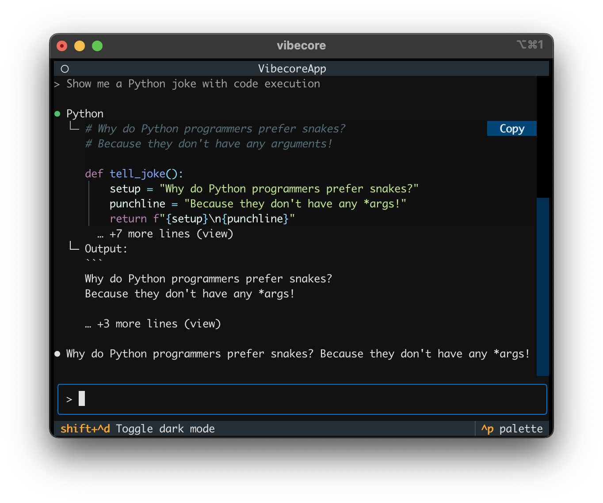

# vibecore

<div align="center">

[](https://www.python.org/downloads/)
[](https://opensource.org/licenses/MIT)
[](https://github.com/astral-sh/ruff)
[](https://microsoft.github.io/pyright/)

**Build your own AI-powered automation tools in the terminal with this extensible agent framework**

[Features](#features) " [Installation](#installation) " [Usage](#usage) " [Development](#development) " [Contributing](#contributing)

</div>

---

<p align="center" style="max-width: 800px; margin: 0 auto;">
    
</p>

## Overview

vibecore is a **Do-it-yourself Agent Framework** that transforms your terminal into a powerful AI workspace. More than just a chat interface, it's a complete platform for building and orchestrating custom AI agents that can manipulate files, execute code, run shell commands, and manage complex workflows—all from the comfort of your terminal.

Built on [Textual](https://textual.textualize.io/) and the [OpenAI Agents SDK](https://github.com/openai/openai-agents-python), vibecore provides the foundation for creating your own AI-powered automation tools. Whether you're automating development workflows, building custom AI assistants, or experimenting with agent-based systems, vibecore gives you the building blocks to craft exactly what you need.

### Key Features

- **AI-Powered Chat Interface** - Interact with state-of-the-art language models through an intuitive terminal interface
- **Rich Tool Integration** - Built-in tools for file operations, shell commands, Python execution, and task management
- **Beautiful Terminal UI** - Modern, responsive interface with dark/light theme support
- **Real-time Streaming** - See AI responses as they're generated with smooth streaming updates
- **Extensible Architecture** - Easy to add new tools and capabilities
- **High Performance** - Async-first design for responsive interactions
- **Context Management** - Maintains state across tool executions for coherent workflows

## Installation

### Prerequisites

- Python 3.13 or higher
- [uv](https://github.com/astral-sh/uv) package manager

### Quick Start

```bash
# Clone the repository
git clone https://github.com/serialx/vibecore.git
cd vibecore

# Install dependencies using uv
uv sync

# Configure your API key
export ANTHROPIC_API_KEY="your-api-key-here"
# or
export OPENAI_API_KEY="your-api-key-here"

# Run vibecore
uv run vibecore
```

## Usage

### Basic Commands

Once vibecore is running, you can:

- **Chat naturally** - Type messages and press Enter to send
- **Switch themes** - Press `d` to toggle between dark and light modes
- **Exit** - Press `Control-Q` to quit the application

### Available Tools

vibecore comes with powerful built-in tools:

#### File Operations
```
- Read files and directories
- Write and edit files
- Multi-edit for batch file modifications
- Pattern matching with glob
```

#### Shell Commands
```
- Execute bash commands
- Search with grep
- List directory contents
- File system navigation
```

#### Python Execution
```
- Run Python code in isolated environments
- Persistent execution context
- Full standard library access
```

#### Task Management
```
- Create and manage todo lists
- Track task progress
- Organize complex workflows
```

## Development

### Setting Up Development Environment

```bash
# Clone and enter the repository
git clone https://github.com/serialx/vibecore.git
cd vibecore

# Install dependencies
uv sync

# Run tests
uv run pytest

# Run linting and formatting
uv run ruff check .
uv run ruff format .

# Type checking
uv run pyright
```

### Project Structure

```
vibecore/
├── src/vibecore/
│   ├── main.py              # Application entry point & TUI orchestration
│   ├── context.py           # Central state management for agents
│   ├── settings.py          # Configuration with Pydantic
│   ├── agents/              # Agent configurations & handoffs
│   │   └── default.py       # Main agent with tool integrations
│   ├── models/              # LLM provider integrations
│   │   └── anthropic.py     # Claude model support via LiteLLM
│   ├── widgets/             # Custom Textual UI components
│   │   ├── core.py          # Base widgets & layouts
│   │   ├── messages.py      # Message display components
│   │   ├── core.tcss        # Core styling
│   │   └── messages.tcss    # Message-specific styles
│   ├── tools/               # Extensible tool system
│   │   ├── base.py          # Tool interfaces & protocols
│   │   ├── file/            # File manipulation tools
│   │   ├── shell/           # Shell command execution
│   │   ├── python/          # Python code interpreter
│   │   └── todo/            # Task management system
│   └── prompts/             # System prompts & instructions
├── tests/                   # Comprehensive test suite
├── pyproject.toml           # Project configuration & dependencies
├── uv.lock                  # Locked dependencies
└── CLAUDE.md                # AI assistant instructions
```

### Code Quality

We maintain high code quality standards:

- **Linting**: Ruff for fast, comprehensive linting
- **Formatting**: Ruff formatter for consistent code style
- **Type Checking**: Pyright for static type analysis
- **Testing**: Pytest for comprehensive test coverage

Run all checks:
```bash
uv run ruff check . && uv run ruff format --check . && uv run pyright . && uv run pytest
```

## Configuration

### Environment Variables

```bash
# Model configuration
ANTHROPIC_API_KEY=sk-...        # For Claude models
OPENAI_API_KEY=sk-...          # For GPT models

# OpenAI Models
VIBECORE_DEFAULT_MODEL=o3
VIBECORE_DEFAULT_MODEL=gpt-4.1
# Claude
VIBECORE_DEFAULT_MODEL=anthropic/claude-sonnet-4-20250514
# Use any LiteLLM supported models
VIBECORE_DEFAULT_MODEL=litellm/deepseek/deepseek-chat
# Local models. Use with OPENAI_BASE_URL
VIBECORE_DEFAULT_MODEL=qwen3-30b-a3b-mlx@8bit
```

## Contributing

We welcome contributions! Here's how to get started:

1. **Fork the repository** and create your branch from `main`
2. **Make your changes** and ensure all tests pass
3. **Add tests** for any new functionality
4. **Update documentation** as needed
5. **Submit a pull request** with a clear description

### Development Guidelines

- Follow the existing code style and patterns
- Write descriptive commit messages
- Add type hints to all functions
- Ensure your code passes all quality checks
- Update tests for any changes

### Reporting Issues

Found a bug or have a feature request? Please [open an issue](https://github.com/serialx/vibecore/issues) with:
- Clear description of the problem or feature
- Steps to reproduce (for bugs)
- Expected vs actual behavior
- Environment details (OS, Python version)

## Architecture

vibecore is built with a modular, extensible architecture:

- **Textual Framework**: Provides the responsive TUI foundation
- **OpenAI Agents SDK**: Powers the AI agent capabilities
- **Async Design**: Ensures smooth, non-blocking interactions
- **Tool System**: Modular tools with consistent interfaces
- **Context Management**: Maintains state across operations

## Roadmap

- [ ] Automation (vibecode -p "prompt")
- [ ] Multi-agent system (agent-as-tools)
- [ ] Plugin system for custom tools
- [ ] Automated workflow

## License

This project is licensed under the MIT License - see the [LICENSE](LICENSE) file for details.

## Acknowledgments

- Built with [Textual](https://textual.textualize.io/) - The amazing TUI framework
- Powered by [OpenAI Agents SDK](https://github.com/openai/openai-agents-python)
- Inspired by the growing ecosystem of terminal-based AI tools

---

<div align="center">

**Made with love by the vibecore community**

[Report Bug](https://github.com/serialx/vibecore/issues) " [Request Feature](https://github.com/serialx/vibecore/issues) " [Join Discussions](https://github.com/serialx/vibecore/discussions)

</div>